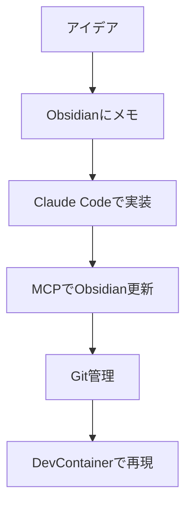

## この記事の対象読者

- Claude Codeを使った開発に興味がある人
- Obsidianでの知識管理を開発プロセスに組み込みたい人
- DevContainerを使った隔離された開発環境を構築したい人
- MCPを活用した効率的な開発フローを学びたい人

## この記事で得られること

DevContainerを使ってObsidianとMCPを連携させた、再現性の高いVibe Coding環境を構築する方法を学べます。

## なぜこの構成なのか

### 課題：開発環境の一貫性とナレッジの散在

従来の開発では以下のような問題がありました：

- 開発環境の差異によるトラブル
- 知識やメモが様々なツールに散在
- プロジェクトの文脈と開発ツールの分離
- Claude Codeの設定やMCPの管理の複雑さ

### 解決策：DevContainerによる統合環境

DevContainerを使うことで：
- 一貫した開発環境の提供
- Obsidianを直接開発プロセスに組み込み
- MCPサーバーの統合管理
- プロジェクトごとの設定の隔離

## 構築手順

### 1. DevContainer設定ファイル

#### devcontainer.json

```json
{
  "name": "Claude Code MCP TypeScript Development Environment",
  "dockerComposeFile": "docker-compose.yml",
  "service": "claude-dev",
  "workspaceFolder": "/workspace",
  "shutdownAction": "stopCompose",
  "postCreateCommand": "/workspace/.devcontainer/init.sh",
  "features": {
    "ghcr.io/anthropics/devcontainer-features/claude-code:1.0": {}
  },
  "customizations": {
    "vscode": {
      "extensions": [
        "ms-vscode.vscode-typescript-next",
        "ms-vscode.vscode-json",
        "esbenp.prettier-vscode",
        "dbaeumer.vscode-eslint",
        "bradlc.vscode-tailwindcss",
        "ms-vscode.vscode-node-azure-pack",
        "christian-kohler.path-intellisense",
        "formulahendry.auto-rename-tag",
        "ms-vscode.vscode-js-debug"
      ],
      "settings": {
        "typescript.preferences.quoteStyle": "double",
        "typescript.suggest.autoImports": true,
        "typescript.updateImportsOnFileMove.enabled": "always",
        "editor.formatOnSave": true,
        "editor.defaultFormatter": "esbenp.prettier-vscode",
        "editor.codeActionsOnSave": {
          "source.fixAll.eslint": "explicit"
        },
        "eslint.validate": [
          "javascript",
          "typescript"
        ],
        "terminal.integrated.defaultProfile.linux": "bash",
        "files.exclude": {
          "**/node_modules": true,
          "**/dist": true,
          "**/.git": true
        }
      }
    }
  },
  "forwardPorts": [3000, 8000, 5173],
  "remoteUser": "utakata",
  "mounts": [
    "source=${localWorkspaceFolder},target=/workspace,type=bind,consistency=cached"
  ]
}
```

**設定のポイント：**
- Claude Code専用Featureを組み込み
- TypeScript開発に必要なVS Code拡張をプリセット
- 開発効率を向上させるリント・フォーマット設定
- 各種開発サーバー用のポート転送設定

### 2. Docker Compose設定

#### docker-compose.yml

```yaml
version: '3.8'

services:
  claude-dev:
    build:
      context: .
      dockerfile: Dockerfile
    volumes:
      - ..:/workspace:cached
      - ~/.anthropic:/home/vscode/.anthropic:ro
      - ${OBSIDIAN_VAULT_PATH:-./obsidian-vault}:/workspace/obsidian-vault
      - /var/run/docker.sock:/var/run/docker.sock
    working_dir: /workspace
    env_file:
      - ./.env
    ports:
      - "3000:3000"
      - "8000:8000"
    command: sleep infinity
    user: vscode
```

**設定のポイント：**
- `OBSIDIAN_VAULT_PATH`環境変数でObsidianボルトを動的にマウント
- Claude設定を読み取り専用でマウント（セキュリティ考慮）
- Dockerソケットをマウントして、コンテナ内からDocker操作を可能に

### 3. Dockerfile

```dockerfile
# Multi-stage build to get uv
FROM ghcr.io/astral-sh/uv:latest AS uv

# Multi-stage build to get Node.js
FROM node:20-slim AS node

FROM mcr.microsoft.com/vscode/devcontainers/base:bullseye

# Copy uv and uvx from the uv image
COPY --from=uv /uv /bin/uv
COPY --from=uv /uvx /bin/uvx

# Copy Node.js from the node image with proper structure
COPY --from=node /usr/local /usr/local

# Install additional packages
RUN apt-get update && export DEBIAN_FRONTEND=noninteractive \
    && apt-get -y install --no-install-recommends \
        git \
        curl \
        wget \
        vim \
        jq \
        build-essential \
    && apt-get autoremove -y && apt-get clean -y && rm -rf /var/lib/apt/lists/*

# Install Claude CLI
RUN curl -fsSL https://claude.ai/claude-cli/install.sh | bash

# Create a non-root user
ARG USERNAME=utakata
ARG USER_UID=1100
ARG USER_GID=$USER_UID

# Create the user
RUN groupadd --gid $USER_GID $USERNAME \
    && useradd --uid $USER_UID --gid $USER_GID -m $USERNAME \
    && apt-get update \
    && apt-get install -y sudo \
    && echo $USERNAME ALL=\(root\) NOPASSWD:ALL > /etc/sudoers.d/$USERNAME \
    && chmod 0440 /etc/sudoers.d/$USERNAME

# Install Node.js global packages for TypeScript development
RUN npm install -g \
    typescript \
    ts-node \
    nodemon \
    @types/node \
    eslint \
    prettier \
    @typescript-eslint/parser \
    @typescript-eslint/eslint-plugin

# Switch to the non-root user
USER $USERNAME

# Set up npm configuration for user
RUN npm config set prefix "/home/$USERNAME/.npm-global" && \
    mkdir -p "/home/$USERNAME/.npm-global/bin" && \
    mkdir -p "/home/$USERNAME/.npm-global/lib"

# Ensure npm and npx are available in PATH
ENV PATH="/home/$USERNAME/.npm-global/bin:/usr/local/bin:$PATH"
ENV NODE_PATH="/usr/local/lib/node_modules:/home/$USERNAME/.npm-global/lib/node_modules"

# Create workspace directory
RUN mkdir -p /home/$USERNAME/.anthropic

WORKDIR /workspace
```

**設定のポイント：**
- マルチステージビルドでuvとNode.jsを効率的に統合
- セキュリティのため非rootユーザーで実行
- TypeScript開発に必要なグローバルパッケージをプリインストール
- 権限設定を適切に構成

### 4. 初期化スクリプト

#### init.sh

```bash
#!/bin/bash

set -e

echo "🚀 Initializing Claude Code MCP Development Environment..."

# Function to substitute environment variables in templates
substitute_env_vars() {
    local template_file="$1"
    local output_file="$2"
    
    if [ ! -f "$template_file" ]; then
        echo "❌ Template file $template_file not found"
        return 1
    fi
    
    echo "📝 Processing template: $template_file -> $output_file"
    
    # Use envsubst to substitute environment variables
    envsubst < "$template_file" > "$output_file"
    
    echo "✅ Created $output_file"
}

# Copy and process .env file
if [ ! -f "/workspace/.devcontainer/.env" ]; then
    if [ -f "/workspace/.devcontainer/.env.template" ]; then
        echo "📋 Copying .env template to .devcontainer..."
        substitute_env_vars "/workspace/.devcontainer/.env.template" "/workspace/.devcontainer/.env"
        echo "⚠️  Please edit /workspace/.devcontainer/.env with your actual values"
    else
        echo "❌ .env template not found"
    fi
else
    echo "ℹ️  .env already exists in .devcontainer"
fi

# Copy and process .mcp.json file
if [ ! -f "/workspace/.mcp.json" ]; then
    if [ -f "/workspace/.devcontainer/.mcp.json.template" ]; then
        echo "📋 Copying .mcp.json template to workspace..."
        substitute_env_vars "/workspace/.devcontainer/.mcp.json.template" "/workspace/.mcp.json"
        echo "✅ Created .mcp.json"
    else
        echo "❌ .mcp.json template not found"
    fi
else
    echo "ℹ️  .mcp.json already exists in workspace"
fi

# Fix npm configuration if needed
echo "🔧 Checking npm configuration..."
CURRENT_PREFIX=$(npm config get prefix)
if [[ "$CURRENT_PREFIX" == *'$USERNAME'* ]]; then
    echo "⚠️  Fixing npm prefix configuration..."
    npm config set prefix "$HOME/.npm-global"
    echo "✅ npm prefix fixed: $(npm config get prefix)"
else
    echo "✅ npm prefix is correctly configured: $CURRENT_PREFIX"
fi

# Install MCP servers
echo "📦 Preparing MCP servers..."
echo "ℹ️  MCP servers will be installed on-demand using npx when needed"
echo "ℹ️  This avoids permission issues with global npm installs"

# Ensure uv is available in PATH
echo "🐍 Verifying uv installation..."
if command -v uv &> /dev/null; then
    echo "✅ uv is available: $(uv --version)"
else
    echo "❌ uv not found - check Dockerfile multistage build"
fi

# Create Claude config directory if it doesn't exist
if [ ! -d "/home/vscode/.anthropic" ]; then
    mkdir -p /home/vscode/.anthropic
    echo "📁 Created Claude config directory"
fi

alias yolo='claude --dangerously-skip-permissions'

echo "🎉 Initialization complete!"
echo ""
echo "📖 Next steps:"
echo "1. Edit /workspace/.devcontainer/.env with your GitHub token and Obsidian vault path"
echo "2. Rebuild the devcontainer to mount your Obsidian vault"
echo "3. Run 'npm install' to install dependencies"
echo "4. Use 'npm run dev' to start development server"
echo "5. Use 'claude --help' to get started with Claude CLI"
echo ""
echo "🔧 Available MCP servers:"
echo "  - mcp-obsidian: Access your Obsidian vault (mounted at /workspace/obsidian-vault)"
echo "  - github: GitHub repository access"  
echo "  - file-system: Local filesystem access"
echo "  - fetch: Web fetch capabilities"
echo "  - docker: Docker container management"
echo "  - playwright: Browser automation and testing"
echo ""
echo "📝 TypeScript development commands:"
echo "  - npm run dev: Start development server with hot reload"
echo "  - npm run build: Build the project"
echo "  - npm run lint: Run ESLint"
echo "  - npm run format: Format code with Prettier"
```

**設定のポイント：**
- テンプレートファイルから環境変数を自動置換
- npm設定の自動修正機能
- MCPサーバーのオンデマンドインストール方式
- 開発に必要な各種コマンドの案内

### 5. セットアップガイド

実際の使用時は以下の手順で環境を構築：

1. **環境変数の設定**
   ```bash
   # .env.templateを.envにコピーして編集
   OBSIDIAN_VAULT_PATH=/Users/username/Documents/MyObsidianVault
   ```

2. **DevContainerの起動**
   - VS Codeでプロジェクトを開く
   - 「Reopen in Container」を選択

3. **自動初期化の実行**
   - `init.sh`が自動実行される
   - 必要な設定ファイルが生成される

4. **開発開始**
   - Obsidianボルトが`/workspace/obsidian-vault`にマウント
   - Claude CLIとMCPサーバーが利用可能

## Vibe Codingの実践

### 1. 開発フローの統合



### 2. 具体的な使用例

#### プロジェクトの始まり

1. **Obsidianでのブレインストーミング**
   - プロジェクトアイデアをObsidianに記録
   - 関連する技術やリソースをリンク

2. **DevContainerでの環境構築**
   - 一貫した開発環境の起動
   - 必要なMCPサーバーの自動設定

3. **Claude Codeでの実装**
   - Obsidianの内容を参照しながら実装
   - 学習内容を自動でObsidianに反映

#### 開発中の知識管理

```typescript
// Claude Codeを使った実装例
async function createObsidianNote(content: string, title: string) {
  // MCP経由でObsidianに新しいノートを作成
  const note = await obsidian.createNote({
    title,
    content,
    path: `Projects/${getCurrentProject()}/`
  });
  
  return note;
}
```

### 3. 学習内容の蓄積

- **自動記録**: 実装中の発見や学習をObsidianに自動記録
- **知識の関連付け**: 既存の知識と新しい学習内容をリンク
- **プロジェクト横断**: 複数プロジェクトでの学習を統合管理

## 実際の効果

### ✅ 再現性の向上

- チームメンバー間での環境差異を解消
- プロジェクトの文脈を含めた環境の共有

### ✅ 知識の活用促進

- 過去の学習内容をすぐに参照可能
- 実装しながら知識を蓄積

### ✅ 開発効率の向上

- 環境構築時間の短縮
- 文脈切り替えのストレス軽減

## 注意点とベストプラクティス

### セキュリティ考慮事項

```yaml
# 読み取り専用マウントの活用
volumes:
  - ~/.anthropic:/home/vscode/.anthropic:ro
```

### パフォーマンス最適化

```json
{
  "mounts": [
    "source=${localWorkspaceFolder},target=/workspace,type=bind,consistency=cached"
  ]
}
```

### 権限管理

```dockerfile
# 非rootユーザーでの実行
ARG USERNAME=utakata
RUN useradd --uid $USER_UID --gid $USER_GID -m $USERNAME
USER $USERNAME
```

## まとめ

DevContainerを使ったObsidianとMCPの統合により、以下を実現できます：

- **一貫した開発環境**: チーム全体で同じ環境を共有
- **知識の統合管理**: 開発プロセスに組み込まれた学習記録
- **効率的な開発フロー**: 文脈を保ったままの開発継続

この構成により、単なる開発環境ではなく、学習と実装が一体化した「Vibe Coding」環境を構築できます。

## 参考リンク

- [Claude Code DevContainer Features](https://github.com/anthropics/devcontainer-features)
- [Obsidian MCP Server](https://github.com/anthropics/mcp-obsidian)
- [DevContainer Specification](https://containers.dev/)